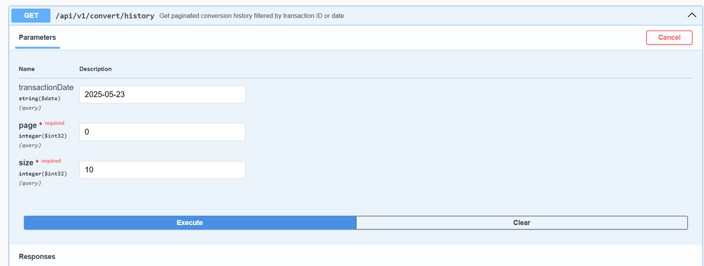
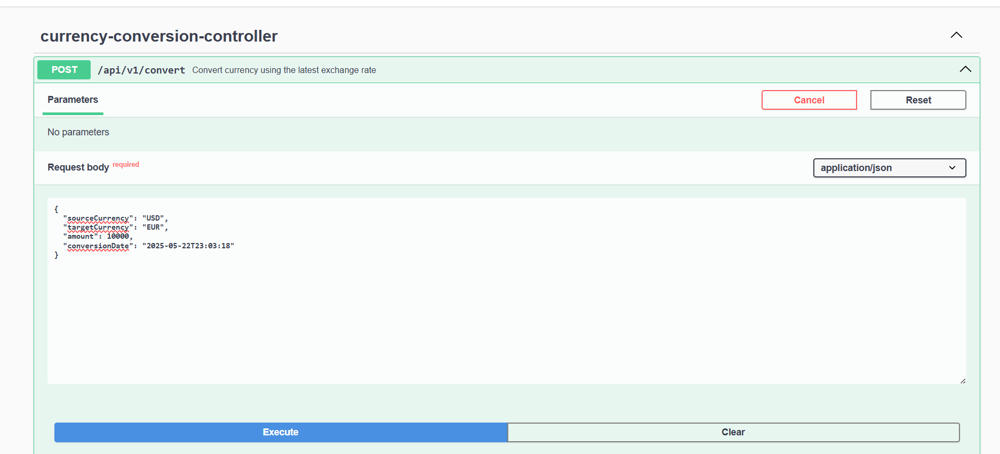
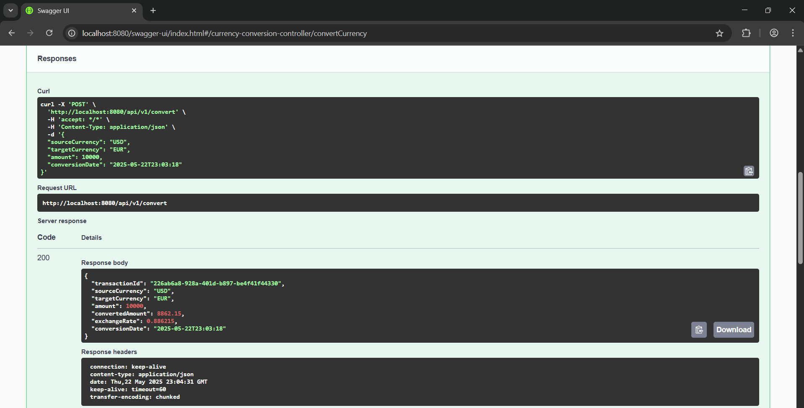
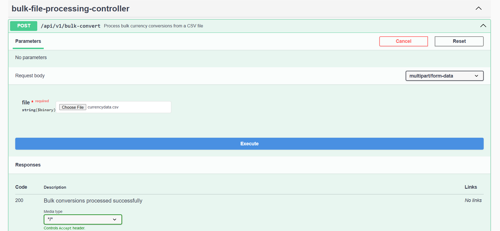
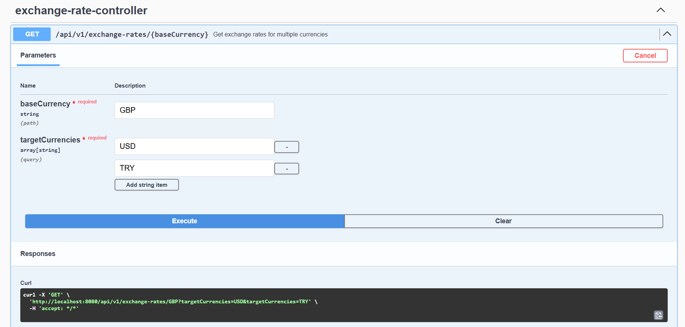
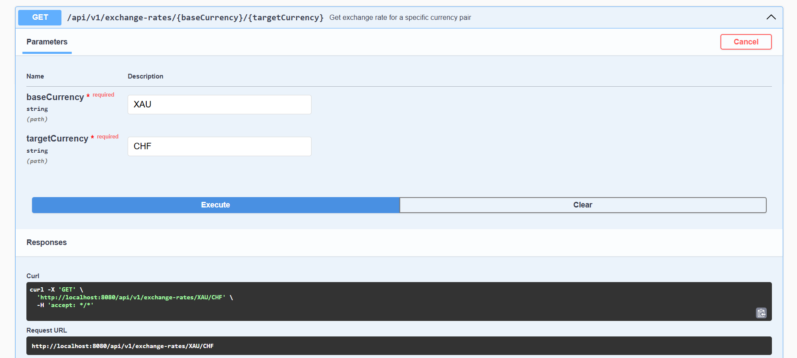
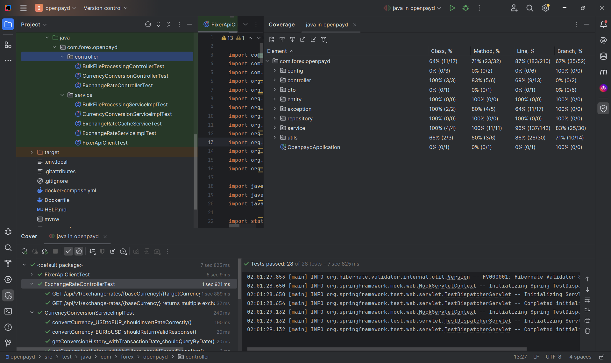

# 💱 Forex Currency Conversion API
[](https://www.oracle.com/java/)  [](https://spring.io/projects/spring-boot)  [](https://maven.apache.org/)
[](https://www.h2database.com/)  [](https://swagger.io/)  [](https://junit.org/junit5/)

## ⚡️ Tech Stack
- **Java 17**: The core programming language.
- **Spring Boot 3.4.5**: Framework for building a scalable and secure API.
- **Spring Data JPA**: Data persistence with clean and efficient repositories.
- **H2 Database**: Lightweight in-memory database for fast and easy testing.
- **MapStruct**: Efficient DTO mapping for clean code.
- **Lombok**: Reduces boilerplate code for entities and DTOs.
- **Maven**: Dependency management and build automation.
- **Swagger (Springdoc OpenAPI)**: API documentation.
- **JUnit 5**: Unit and integration testing.

---  

## 🚦 System Requirements
- **Java 17** or later
- **Maven 4.0.0** or later
- **Internet Connection** (for dependency download)
- **Any IDE (IntelliJ IDEA, Eclipse, VS Code)**

---  


A robust Spring Boot-based API for converting currencies, fetching exchange rates, processing bulk conversions via CSV, and storing historical records.

---

## 🚀 Getting Started

### 1. Clone the repository

```bash
git clone https://github.com/seadmustafa/FXAPI.git
cd FXAPI
```

### 2. Configure API Key ( Optional )

Set your **Fixer.io API key** in an environment variable:
> Added for prod environment, for security purposes!

```bash
export FIXER_API_KEY=your-fixer-key
```

### 3. Run locally or via Docker

#### Run via Docker

```bash
docker-compose up --build
```

### Run locally 

### Clone the Repository 

```
cd FXAPI
```

✅ Build the Project

```
mvn clean install  
```

✅ Run the Application

```
mvn spring-boot:run
```

### 4. API Access

- Swagger UI: [http://localhost:8080/swagger-ui.html](http://localhost:8080/swagger-ui.html)
- H2 Console: [http://localhost:8080/h2-console](http://localhost:8080/h2-console)

---

## 🧠 Architectural Overview

This project follows a clean, layered architecture that separates:

- 🔌 **External communication** (Fixer API client)
- 🧠 **Caching logic** (ExchangeRateCacheService)
- 🧪 **Business logic** (ExchangeRateServiceImpl)
- 🗂 **Persistence** (ConversionHistory + Repository)
- 📊 **DTO layers** (model for request/response)

---

## ♻️ Retry Mechanism

The project uses Spring Retry (`@Retryable`) to gracefully handle transient failures when calling the external **Fixer.io API**.

If the API fails due to rate limiting (e.g. error code `106`), the client automatically retries up to 4 times with exponential backoff (2s, 4s, 8s…).

```java
@Retryable(
    value = ForexAppException.class,
    maxAttempts = 4,
    backoff = @Backoff(delay = 2000, multiplier = 2)
)
```

- **Applied in:** `FixerApiClient#getExchangeRate(...)`
- Ensures robust handling of network or quota-based failures

---


## 📘 API Endpoints


### 4. API Access

- Swagger UI: [http://localhost:8080/swagger-ui.html](http://localhost:8080/swagger-ui.html)
- H2 Console: [http://localhost:8080/h2-console](http://localhost:8080/h2-console)

---


**Base URL:** `http://localhost:8080/api/v1`

### 🔁 Currency Conversion

| Method | Endpoint            | Description                                          |
|--------|---------------------|------------------------------------------------------|
| POST   | `/convert`          | Convert currency using the latest exchange rate     |
| GET    | `/convert/history`  | Get paginated conversion history by date            |

### 📂 Bulk File Processing

| Method | Endpoint         | Description                                           |
|--------|------------------|-------------------------------------------------------|
| POST   | `/bulk-convert`  | Process bulk currency conversions from a CSV file     |

### 💱 Exchange Rates

| Method | Endpoint                                              | Description                                           |
|--------|-------------------------------------------------------|-------------------------------------------------------|
| GET    | `/exchange-rates/{baseCurrency}`                      | Get exchange rates for multiple currencies            |
| GET    | `/exchange-rates/{baseCurrency}/{targetCurrency}`     | Get exchange rate for a specific currency pair        |

---
 


## 📷 API Examples & Responses

 

## currency-conversion-controller

> Request
### api/v1/convert

``` 
{
  "sourceCurrency": "EUR",
  "targetCurrency": "ALL",
  "amount": 10000,
  "conversionDate": "2025-05-23T12:00:10"
}
```

> Response

```
{
  "transactionId": "ef6232b8-de07-478d-a4e3-40084c1fc852",
  "sourceCurrency": "EUR",
  "targetCurrency": "USD",
  "amount": 1000,
  "convertedAmount": 1135.815,
  "exchangeRate": 1.135815,
  "conversionDate": "2025-05-23T12:00:10"
}
```

### api/v1/convert/history



```
{
  "content": [
    {
      "transactionId": "ef6232b8-de07-478d-a4e3-40084c1fc852",
      "sourceCurrency": "EUR",
      "targetCurrency": "USD",
      "amount": 1000,
      "convertedAmount": 1135.815,
      "exchangeRate": 1.1358,
      "conversionDate": "2025-05-23T12:00:10"
    }
  ],
  "pageable": {
    "pageNumber": 0,
    "pageSize": 10,
    "sort": {
      "empty": false,
      "sorted": true,
      "unsorted": false
    },
    "offset": 0,
    "paged": true,
    "unpaged": false
  },
  "last": true,
  "totalElements": 1,
  "totalPages": 1,
  "first": true,
  "size": 10,
  "number": 0,
  "sort": {
    "empty": false,
    "sorted": true,
    "unsorted": false
  },
  "numberOfElements": 1,
  "empty": false
}
```



> Response




### Bulk-file-processing-controller

> Request



> Response

``` 
{
  "totalRecords": 4,
  "successfulConversions": 4,
  "failedConversions": 0,
  "conversionDate": "2025-05-22T10:30:00",
  "results": [
    {
      "transactionId": "TXN100001",
      "success": true,
      "convertedAmount": 1547.233,
      "errorMessage": null,
      "conversionDate": "2025-05-22T10:30:00"
    },
    {
      "transactionId": "TXN100002",
      "success": true,
      "convertedAmount": 1547.233,
      "errorMessage": null,
      "conversionDate": "2025-05-22T10:30:00"
    },
    {
      "transactionId": "TXN100003",
      "success": true,
      "convertedAmount": 1547.233,
      "errorMessage": null,
      "conversionDate": "2025-05-22T10:30:00"
    },
    {
      "transactionId": "TXN100004",
      "success": true,
      "convertedAmount": 39032.083,
      "errorMessage": null,
      "conversionDate": "2025-05-22T10:30:00"
    }
  ],
  "successfulConversionsList": null,
  "failedConversionsList": null
}
```

### api/v1/exchange-rates/{baseCurrency}

> Request  



> Response
``` 
{
  "USD": {
    "baseCurrency": "GBP",
    "rateTimestamp": "2025-05-23T15:00:26.3603914",
    "rates": {
      "USD": 1.350521
    }
  },
  "TRY": {
    "baseCurrency": "GBP",
    "rateTimestamp": "2025-05-23T15:03:50.416264",
    "rates": {
      "TRY": 52.713639
    }
  }
}
```

#### api/v1/exchange-rates/{baseCurrency}/{targetCurrency}

> Request



> Response

``` 
{
  "baseCurrency": "XAU",
  "rateTimestamp": "2025-05-23T15:05:44.6776642",
  "rates": {
    "CHF": 2748.589443
  }
}
```


---

## 🔗 Swagger

Available at: [http://localhost:8080/swagger-ui/index.html](http://localhost:8080/swagger-ui/index.html)


## 🧪 Testing Strategy

### Unit Testing & Code Coverage

- The test suite includes comprehensive **unit tests**.
- Key components such as services, controllers, and clients are thoroughly validated.
- ✅ **Code coverage is greater than 85%** across business logic and API layers.



---
